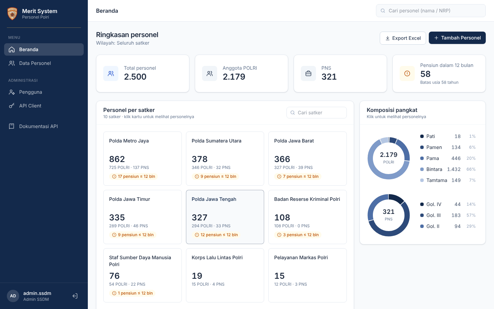
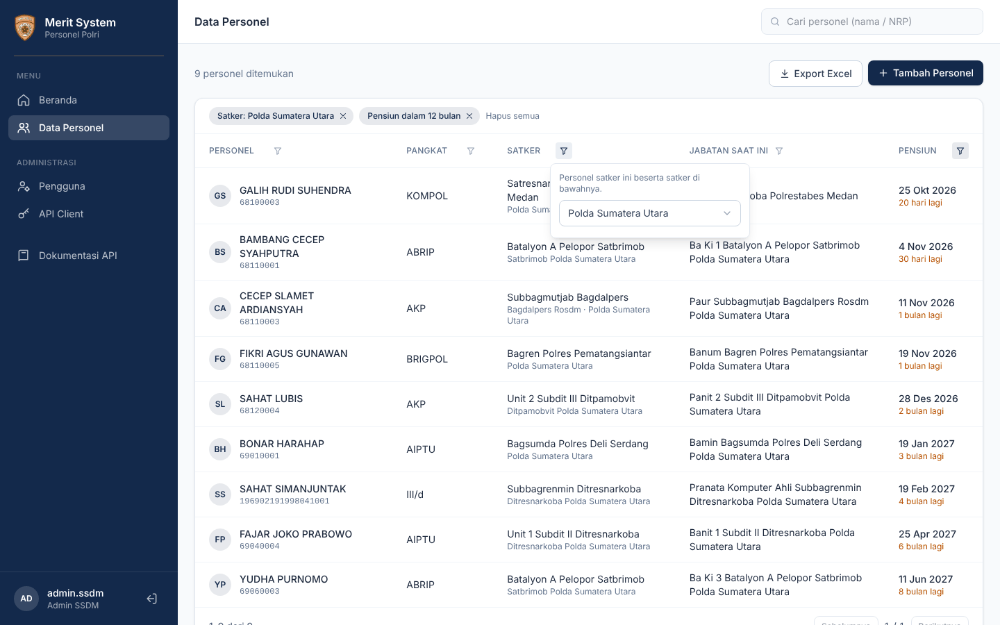
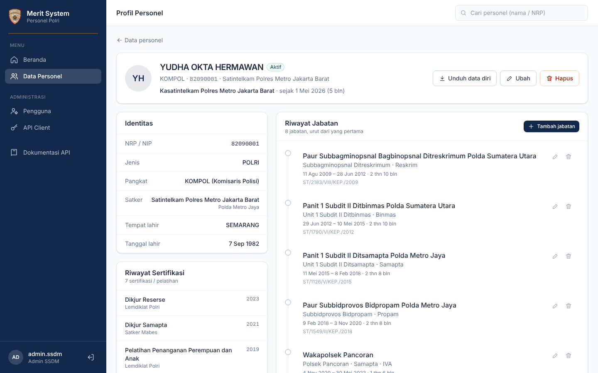
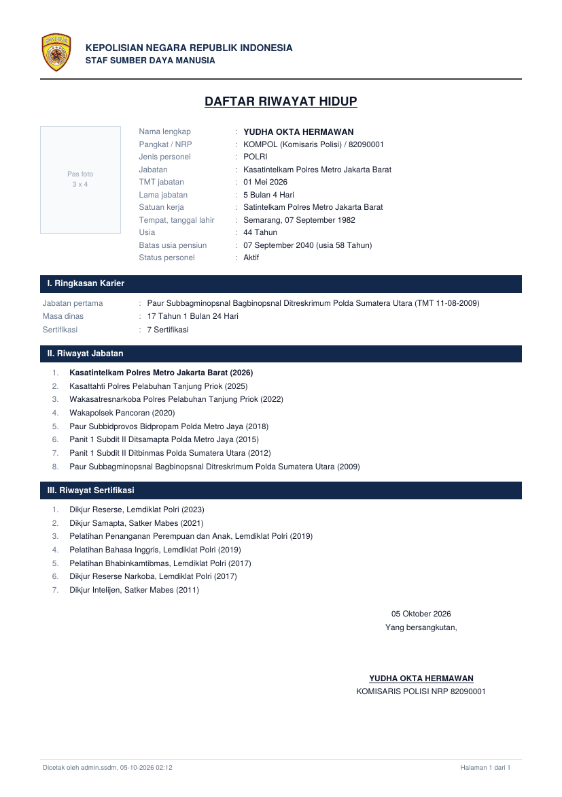

# Merit System Personel Polri

Prototype aplikasi pengelolaan data personel dan riwayat jabatan untuk Staf SDM Polri.
Terdiri dari REST API (Go) dan aplikasi web (React). Data contoh berisi 2.500 personel
dummy.



## Isi

- [Fitur](#fitur)
- [Menjalankan](#menjalankan)
- [Akun demo](#akun-demo)
- [Dokumentasi API](#dokumentasi-api)
- [Hak akses](#hak-akses)
- [Validasi data](#validasi-data)
- [Struktur folder](#struktur-folder)

## Fitur

| Kebutuhan | Implementasi |
|---|---|
| CRUD personel dan riwayat jabatan | Tambah, ubah, hapus personel dan jabatannya. Hapus memakai soft delete. Saat jabatan definitif baru ditambahkan, jabatan aktif sebelumnya otomatis ditutup per H-1 TMT jabatan baru. |
| Validasi sebelum simpan | Tiga lapis: tipe/format di request, aturan bisnis di service, constraint di database. Pesan error dikembalikan per field. |
| Hak akses | Admin SSDM mengakses semua satker dan mengelola pengguna. Operator hanya satkernya dan satker di bawahnya. |
| API untuk aplikasi lain | Client credentials (`client_id` + `client_secret`) menghasilkan token 1 jam. Akses dibatasi scope dan wilayah satker per aplikasi. |
| Profil personel | Identitas, jabatan saat ini, riwayat jabatan kronologis, dan riwayat sertifikasi. |

Fitur tambahan:

- **Beranda**: jumlah personel per satker, komposisi pangkat, personel yang pensiun dalam 12 bulan (batas usia 58 tahun), dan mutasi terbaru.
- **Daftar personel**: filter dan urutan langsung di judul kolom tabel (nama, pangkat, satker, status, pensiun).
- **Export Excel**: mengikuti filter yang sedang aktif.
- **Daftar Riwayat Hidup (PDF)**: diunduh dari halaman profil personel.
- **Kelola pengguna dan API client**: khusus Admin SSDM.

| Data personel | Profil personel |
|---|---|
|  |  |

<details>
<summary>Contoh PDF Daftar Riwayat Hidup</summary>



</details>

## Teknologi

| Bagian | Teknologi |
|---|---|
| Backend | Go, Gin, GORM, JWT, excelize (Excel), fpdf (PDF) |
| Database | PostgreSQL 14+ |
| Frontend | React 19, React Router, Vite, Tailwind CSS |

## Menjalankan

Kebutuhan: Go 1.26+, Node.js 20.19+ atau 22.12+, PostgreSQL 14+.

### 1. Database

```bash
createdb merit_db
psql -d merit_db -f Backend/merit_schema_final.sql
psql -d merit_db -f Backend/merit_seed_final.sql
```

### 2. Backend

```bash
cd Backend
cp .env.example .env      # isi koneksi database dan JWT_SECRET
go mod tidy
go run ./cmd/api
```

API berjalan di `http://localhost:8080/api`, dokumentasi di `http://localhost:8080/docs`.

### 3. Frontend

```bash
cd Frontend
npm install
npm run dev
```

Buka `http://localhost:5173`. Request ke `/api` diteruskan ke backend oleh proxy Vite.

## Akun demo

Password semua akun: `Merit2026!`

| Username | Role | Wilayah |
|---|---|---|
| `admin.ssdm` | Admin SSDM | Semua satker |
| `opr.pmj` | Operator | Polda Metro Jaya |
| `opr.pmj.narkoba` | Operator | Ditresnarkoba Polda Metro Jaya |
| `opr.jaksel` | Operator | Polres Metro Jakarta Selatan |
| `opr.jabar`, `opr.jateng`, `opr.jatim`, `opr.sumut` | Operator | Polda masing-masing |
| `opr.nonaktif` | Operator | Akun nonaktif, untuk uji login ditolak |

API client demo, secret semua client: `secret-demo-2026`

| client_id | Scope | Wilayah |
|---|---|---|
| `app-pmj` | `personel:read`, `jabatan:read` | Polda Metro Jaya |
| `app-bkn` | `personel:read` | Semua satker |
| `app-lemdiklat` | `personel:read`, `kualifikasi:read`, `kualifikasi:write` | Semua satker |
| `app-legacy` | dicabut | untuk uji akses ditolak |

## Dokumentasi API

Spesifikasi OpenAPI 3.0: [`Backend/docs/openapi.yaml`](Backend/docs/openapi.yaml)

- Saat backend berjalan: `http://localhost:8080/docs` (Swagger UI, bisa langsung dicoba)
- Tanpa menjalankan backend: impor file tersebut ke [editor.swagger.io](https://editor.swagger.io)

### Contoh pemakaian

Login sebagai pengguna:

```bash
curl -X POST http://localhost:8080/api/login \
  -H "Content-Type: application/json" \
  -d '{"username":"opr.pmj","password":"Merit2026!"}'
```

Token untuk aplikasi lain:

```bash
curl -X POST http://localhost:8080/api/oauth/token \
  -H "Content-Type: application/json" \
  -d '{"client_id":"app-pmj","client_secret":"secret-demo-2026"}'
```

Pakai token di header `Authorization`:

```bash
curl "http://localhost:8080/api/personel?q=budi&jenis=POLRI&sort=pangkat" \
  -H "Authorization: Bearer <token>"
```

### Ringkasan endpoint

Semua endpoint di bawah prefix `/api`.

| Grup | Endpoint |
|---|---|
| Auth | `POST /login`, `POST /oauth/token`, `GET /auth/me` |
| Personel | `GET/POST /personel`, `GET/PUT/DELETE /personel/{id}` |
| Riwayat jabatan | `GET/POST /personel/{id}/riwayat-jabatan`, `PUT/DELETE /riwayat-jabatan/{id}` |
| Daftar riwayat hidup | `GET /personel/{id}/drh` (PDF) |
| Dashboard dan export | `GET /dashboard`, `GET /export/personel` (Excel) |
| Referensi | `GET /referensi/pangkat`, `/satker`, `/fungsi`, `/nivelering` |
| Pengguna (admin) | `GET/POST /users`, `PUT /users/{id}`, `PATCH /users/{id}/status`, `POST /users/{id}/reset-password` |
| API client (admin) | `GET/POST /api-clients`, `PUT /api-clients/{id}`, `PATCH /api-clients/{id}/status`, `POST /api-clients/{id}/rotate-secret` |

Parameter daftar personel (`GET /personel`, juga berlaku untuk export):
`q`, `satker_id`, `status`, `jenis`, `kelompok`, `tanpa_jabatan`, `akan_pensiun`, `sort`, `page`, `limit`.

### Format response

```json
{ "success": true, "data": { } }
{ "success": false, "error": "validasi gagal", "details": { "nrp_nip": "NRP POLRI harus 8 digit angka" } }
```

## Hak akses

Setiap request diperiksa dalam tiga tahap:

1. **Autentikasi**: token valid dan akun atau aplikasi masih aktif. Gagal: `401`.
2. **Permission**: role atau scope punya izin untuk aksi tersebut. Gagal: `403`.
3. **Wilayah**: data berada di satker yang menjadi kewenangan. Gagal: `404`, supaya data di luar wilayah tidak terlihat ada.

| Pemanggil | Izin | Wilayah |
|---|---|---|
| Admin SSDM | Semua, termasuk kelola pengguna dan API client | Semua satker |
| Operator | CRUD personel dan riwayat jabatan | Satker sendiri dan turunannya |
| Aplikasi lain | Sesuai `scopes` | Sesuai `akses_satker_id` (kosong = semua) |

Akun atau API client yang dinonaktifkan langsung tidak bisa dipakai, termasuk token yang sudah terbit, karena status dicek ulang di setiap request.

## Validasi data

Personel:

- NRP POLRI 8 digit angka, NIP PNS 18 digit angka, tidak boleh dobel (`409`)
- Pangkat harus sesuai jenis personel (pangkat POLRI untuk POLRI, golongan untuk PNS)
- Tanggal lahir format `YYYY-MM-DD`, tidak di masa depan, minimal 1940
- Satker harus berada di wilayah pengguna (`403`)

Riwayat jabatan:

- TMT mulai setelah tanggal lahir, TMT selesai tidak sebelum TMT mulai
- Satu personel hanya boleh punya satu jabatan definitif aktif
- Jabatan definitif tidak boleh tumpang tindih waktunya (PLT/PLH boleh merangkap)

## Struktur folder

```
Backend/
  cmd/api/              entry point dan routing
  internal/
    config/             baca .env dan koneksi database
    controller/         handler HTTP
    service/            logika bisnis dan cek wilayah
    repository/         query database
    middleware/         autentikasi dan permission
    dto/                format request dan validasi
    model/              struct tabel
    report/             PDF Daftar Riwayat Hidup
    helper/             JWT, response, error database
  docs/                 openapi.yaml dan Swagger UI
  merit_schema_final.sql
  merit_seed_final.sql
Frontend/
  src/pages/            halaman
  src/components/       komponen UI
  src/context/          sesi login
  src/lib/              pemanggil API dan format data
docs/screenshots/       gambar untuk README
```
